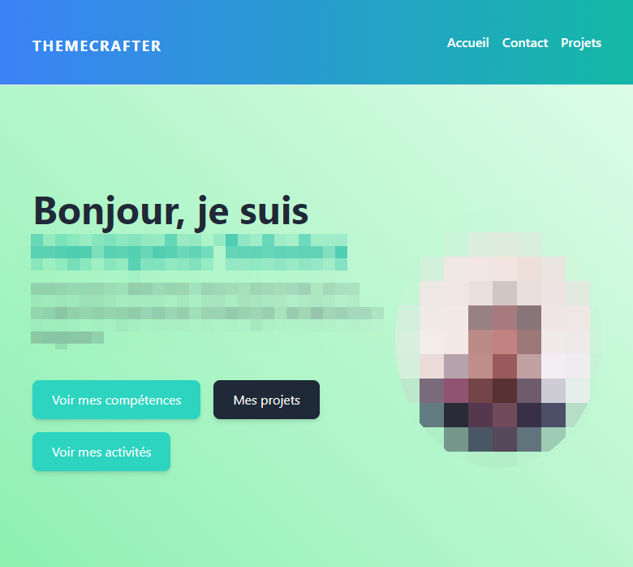

# Magnific Portfolio

## Description

**Magnific Portfolio** est un thème WordPress conçu pour mettre en valeur vos projets, compétences et activités/loisirs. Ce thème offre une interface utilisateur élégante et facile à personnaliser, idéale pour les professionnels souhaitant présenter leur travail de manière visuelle.

## Créateur

Ce projet a été créé par **Rktoo**.

## Installation

1. Téléchargez le dossier du thème **Magnific Portfolio**.
2. Accédez à votre tableau de bord WordPress.
3. Allez dans **Apparence** > **Thèmes**.
4. Cliquez sur **Ajouter** et ensuite sur **Téléverser un thème**.
5. Sélectionnez le dossier que vous avez téléchargé et cliquez sur **Installer maintenant**.
6. Activez le thème après l'installation.

## Personnalisation

Pour ajouter des informations sur l'utilisateur du thème :

1. Allez dans **Apparence** > **Personnaliser**.
2. Cliquez sur **Informations sur le portfolio**.
3. Remplissez les champs nécessaires pour afficher vos informations personnelles et professionnelles.
4. Ajoutez vos projets, vos compétences vos activités et vos liens depuis l'interface admin du menu **magnific portfolio**
## Licence

Ce projet est sous la **GNU General Public License**. Pour plus d'informations, consultez le fichier LICENSE.

## Contact

Pour toute question ou demande d'assistance, veuillez me [contacter](mailto:heryinjaka72@gmail.com).
